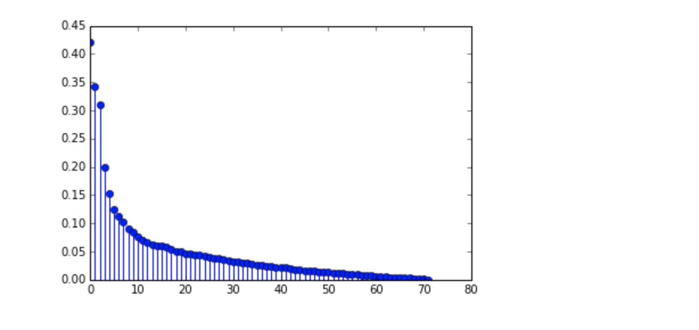
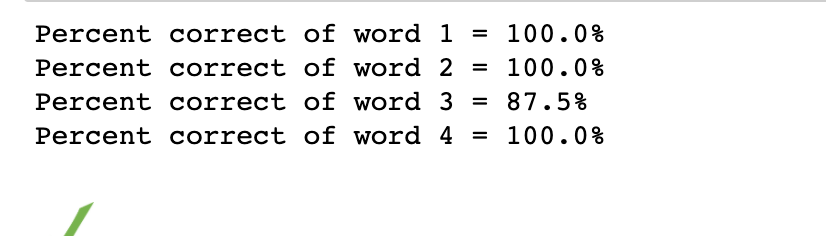

# Past School projects
## Bear Maps
*Implemented*:
1) Rastering of images
2) A* algorithim to find shortest path
###### First open browser

###### A*

###### Rastering

###### Themes

## Voice Controlled Car SIX33en(Voice Component)

*Implemented*:
1) Aligned my Data
2) Perform PCA to represent the data in a lower dimension
3) Trained and tested car

###### Aligning data

###### Clustering

###### PCA
 

###### Test Data

## MandelBrot
*Implemented*:
1) Complex number subroutines to analyze complex number's stablity
2) Read and worte to .ppm P6 format to form images and evenually a complete zoomer 
###### A frame from the images the project created

