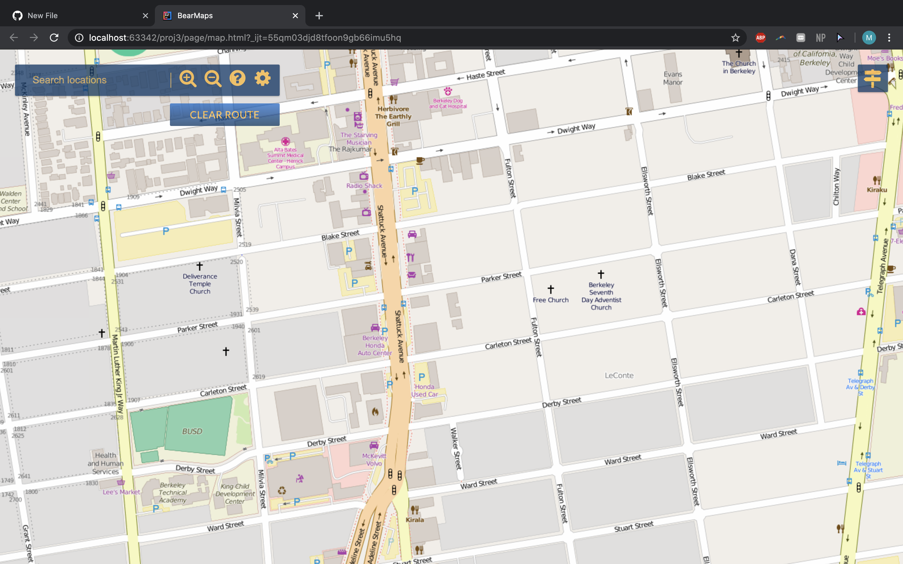
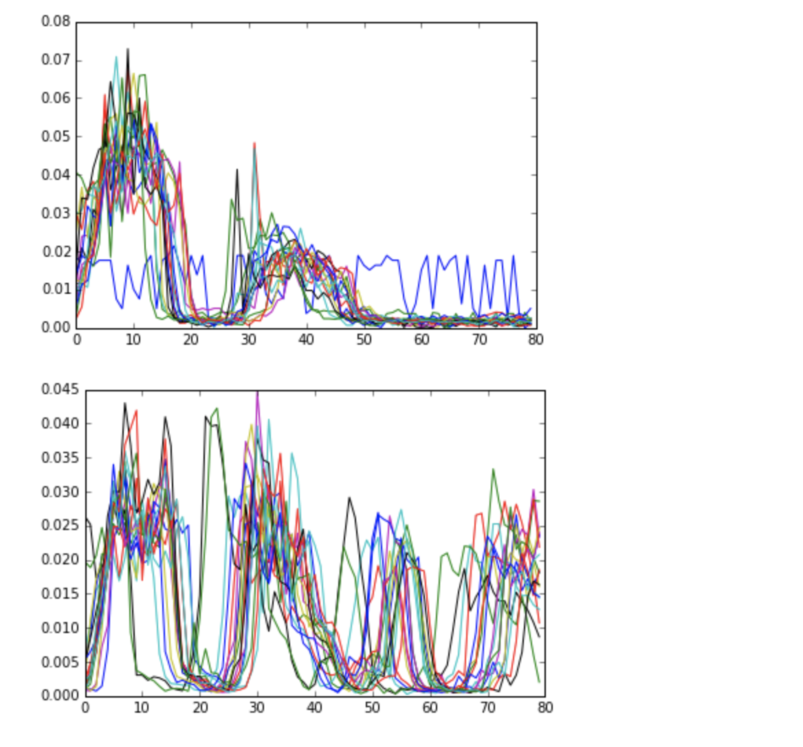
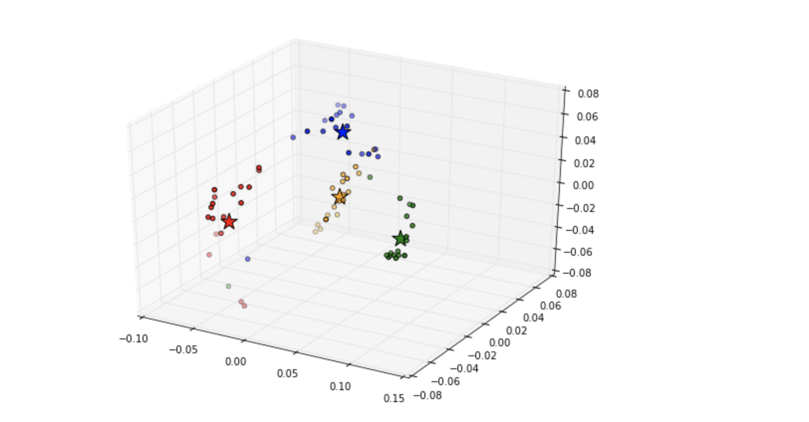
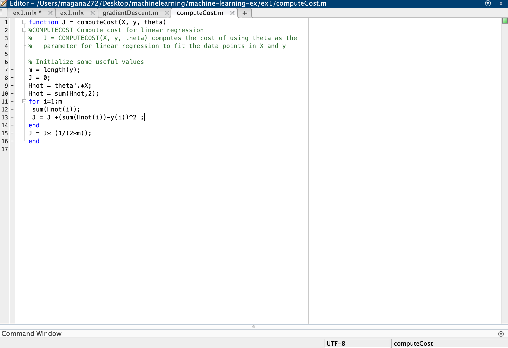
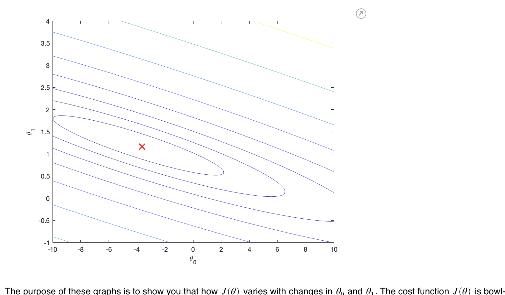
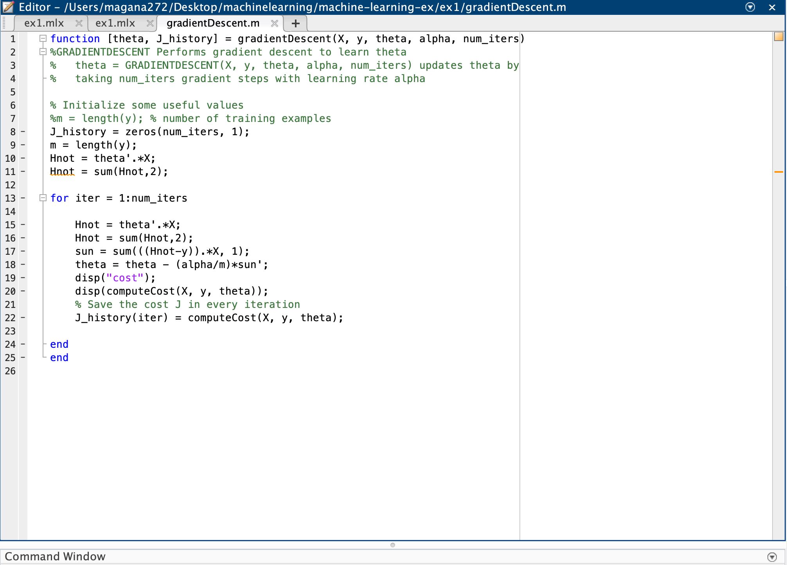
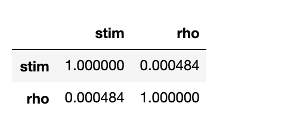
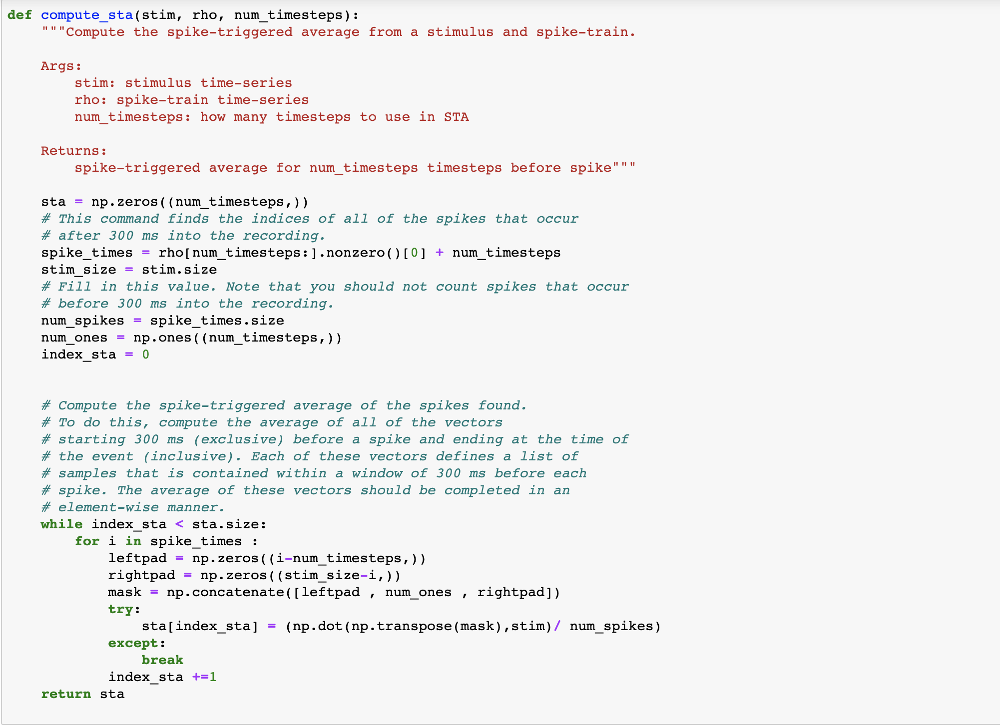
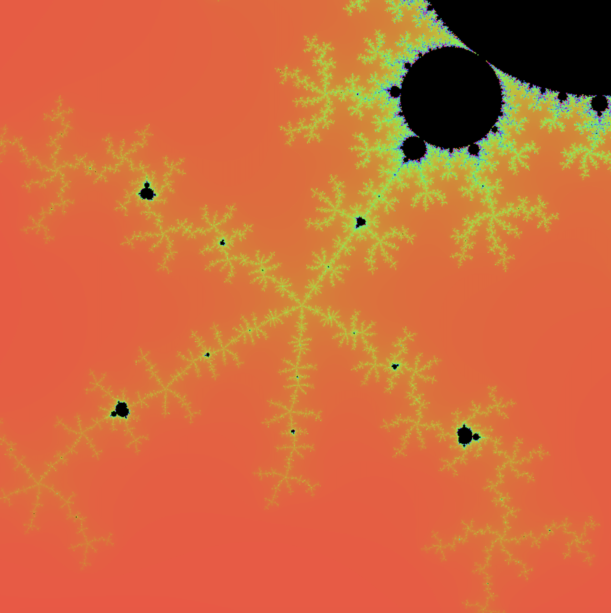

# Past School projects
## Bear Maps
*Implemented*:
1) Rastering of images
2) A* algorithim to find shortest path
###### First open browser

###### A*

###### Rastering

###### Themes

## SIX33en(Voice Component)
*Implemented*:
1) Aligned my Data
2) Perform PCA torepresent the data in a lower dimension
3) Trained and tested car

###### Aligning data

###### Clustering

## Gradient Descent

*Implemented*:
1) Cost function
2) Gradient descent algo

###### Cost Function

###### Completed trained parameters

###### Algo

## Spike triggered Average
*Implemented*:
1) Standard Spike triggered Average
2) Reading from pickled file
3) Look at inital data, and tried to form any inital observations

###### Corrolation

###### Funtion for STA

*Implemented*:
1) Standard Spike triggered Average
2) Reading from pickled file
3) Look at inital data, and tried to form any inital observations

## MandelBrot
*Implemented*:
1) Complex number subroutines to analyze complex number's stablity
2) Read and worte to .ppm P6 format to form images and evenually a complete zoomer 
###### A frame from the images the project created

